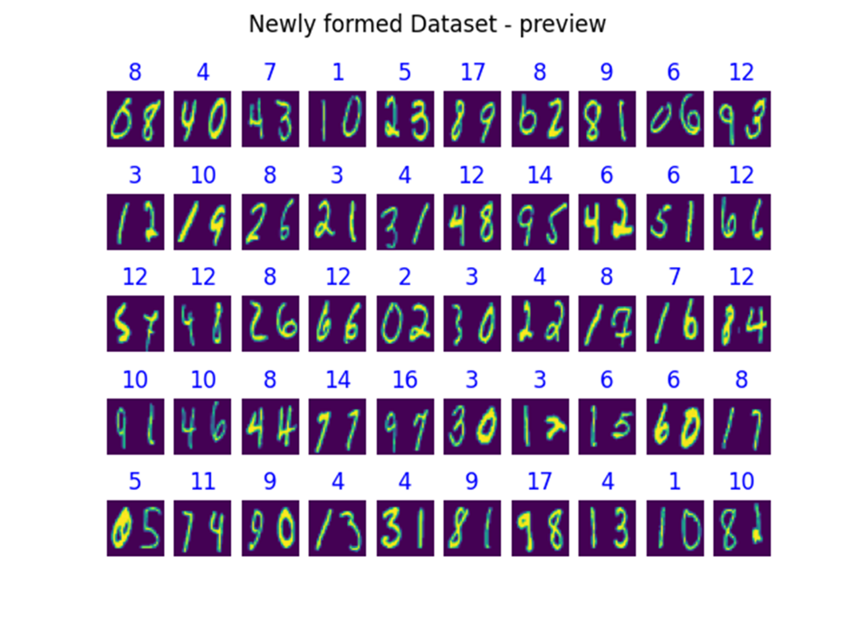
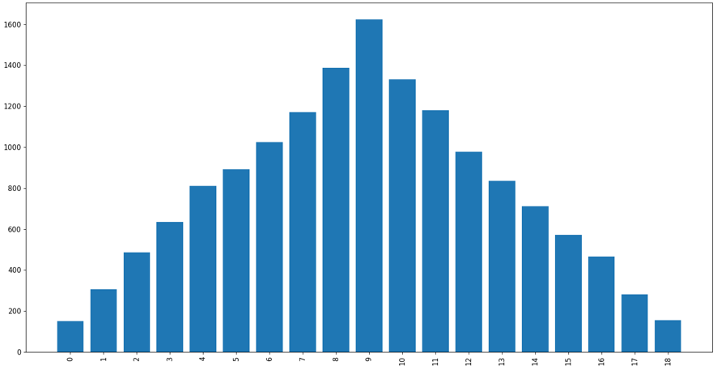
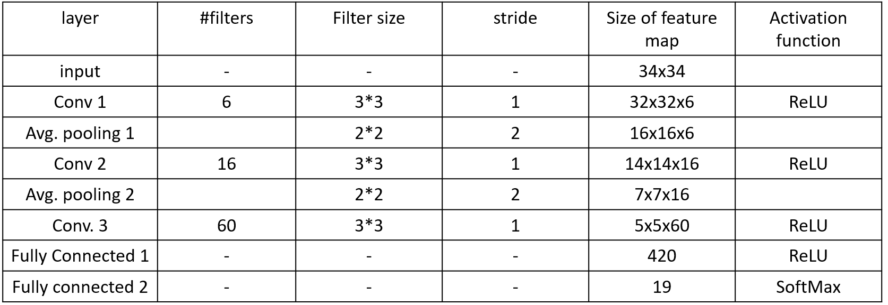
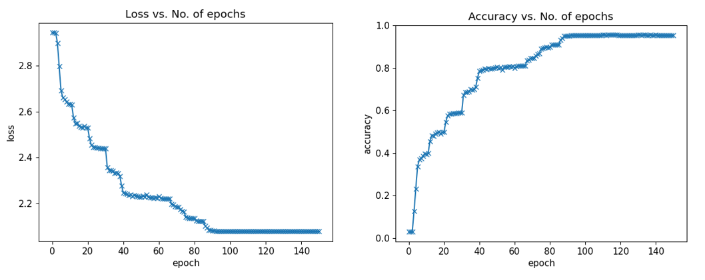
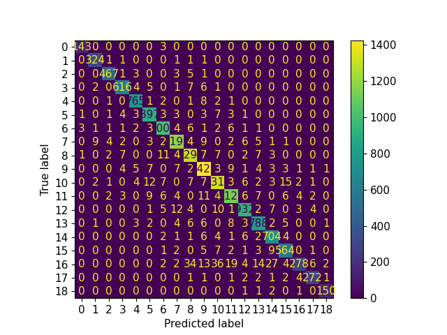

This is a sample program that adds two digit images, it is written in Pytorch(Python)  
1. Generate new dataset from MNIST digits dataset by randomly pairing two digits. 
The paired digits has their sum as label
, i.e., we have now [0~18] numbers as labels for the new dataset 
   
     

      
       the resulting dataset is imbalanced, as it can be seen from the above image  
   this samples imbalance will be taken care of during the training by considering per class sample weight 
2. Design a simple network for adding the two digit images
    The designed architecture is derived from "Lenet" as it is has shown good classification results on MNIST dataset
     
3. Train the Network
    Dataset split into training and validation set[80% vs 20%]
     Input to the network: image with two channels(each containg on digit) is fed to the network.
   1. this allows to apply the same filters to both images
   2. no distortion introduced to the digit images
   
     
    The model converges around 100 epochs with ~95% accuracy
4. choose an evaluation metric
  1. Accuracy per class
     chosen as the newly generated dataset is imbalanced
     Below is the confusion matrix on test dataset 
  
